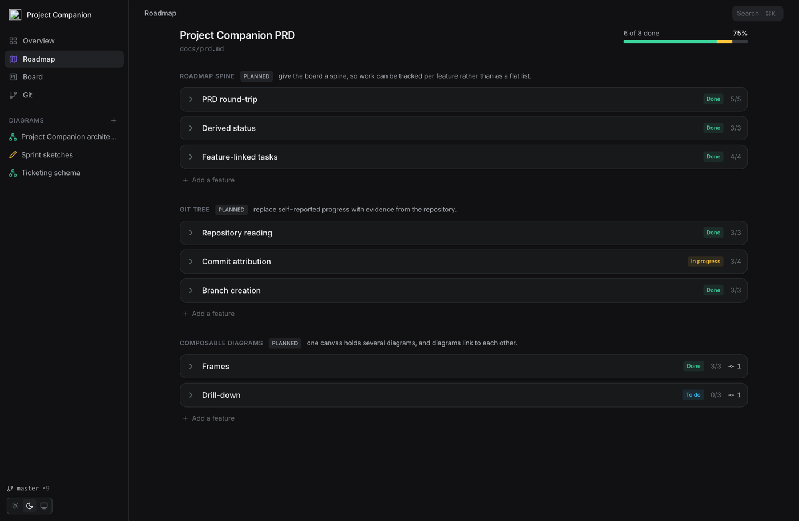
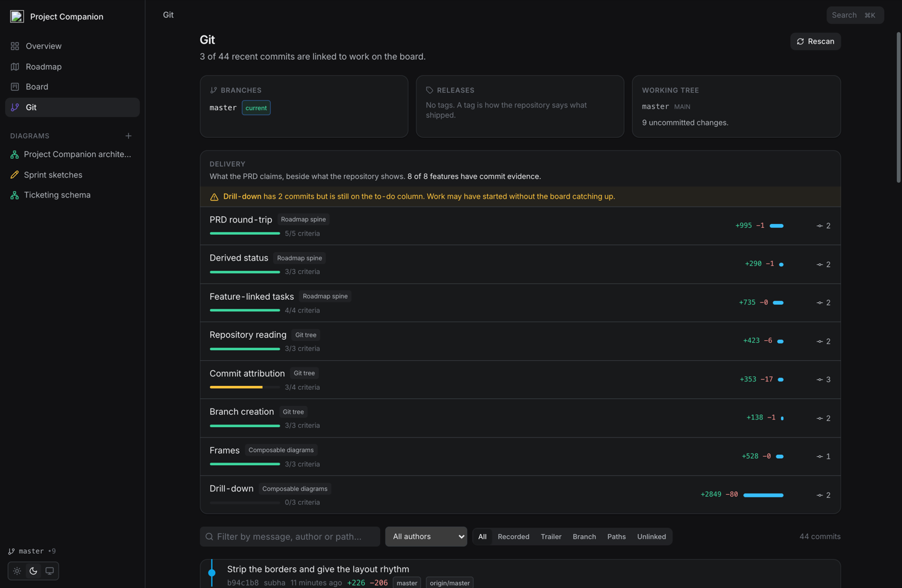
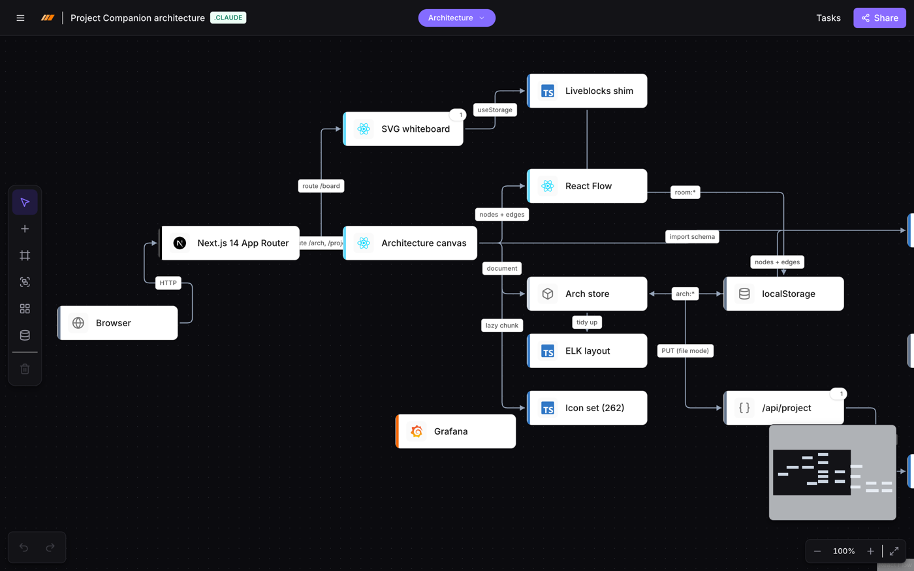

<div align="center">
  
  <h1>Project Companion</h1>
  <p><strong>Project management that runs with your coding agent.</strong></p>
  <p>
    Lay out the architecture, write the PRD, track the work — and let the git
    history prove what was actually built.
  </p>
</div>

---

Most project tools ask you to report progress. This one reads it.

A task is `done` because someone dragged a card, which tells you nothing. Project
Companion links every commit back to the task and the PRD feature it belongs to,
so the board can be checked against the repository instead of trusted.

It is local-first and file-backed on purpose: everything lives in your repo as a
single `.project` file, so the coding agent you already use can read and write it
with ordinary tools.



## What it does

**The PRD is the feature list.** `docs/prd.md` is an ordinary markdown document.
The app reads *and writes* it, splicing only the ranges it owns — prose, tables
and code fences survive an edit byte for byte. Ticking an acceptance criterion in
the browser changes exactly one character in the file.

**Status is derived, not stored.** All criteria checked means done, some means in
progress. Your agent ticks a box and the board moves; you move a card and the
document is untouched.

**Commits attribute themselves.** Five signals, strongest first: a recorded sha,
an agent run that was watched writing those files, a `project-companion: <id>`
trailer, the branch name, then overlap with a component's declared paths. The
last one only ever names a *component*, never a task — it is an inference, and a
task is a specific claim. Where two things claim a commit equally well, neither
gets it.



**Every node on the canvas can own work.** A component is an architecture node
with a directly responsible individual, a region of the source, and its own
board, spec slice and evidence. `Paths:` is the join key — declare it once, and
commits, tasks, features, agent runs and review findings all resolve through it.

```bash
project-companion whose lib/auth/token.ts
# auth-service  grace@example.com
#   matched lib/auth/**
```

**Agents are supervised, not anonymous.** A run has a budget, a path boundary
inherited from its component, and a state machine a person controls. It records
itself from your coding agent's own hooks, so nothing has to be reported. Going
over budget blocks the run rather than failing the session; writing outside the
boundary is refused and reported.

**Done can be proven.** A feature names the command that proves it works. If the
check fails, the ticked criteria are unticked — a claim the repository just
refused should not still be standing. The roadmap draws *proven*, *failing* and
*claimed* differently, which is the distinction every other board hides.

**The architecture is checked against the code.** The canvas is a claim about
how the system should be structured; the import graph is what it is. `drift`
reports the difference — coupling that exists and is not drawn.

```bash
project-companion drift
# 21 undeclared dependencies:
#   canvas -> surfaces  (21 imports)
#       app/arch/[boardId]/_components/c4-inspector.tsx imports components/ui/input.tsx
```

**Review is prepared, not just requested.** `review <sha>` writes a packet: the
criteria the change has to satisfy and whether their checks pass, what to read
and in what order, what to skip, and which boundaries it crosses. Findings come
back through MCP, and any finding anchored outside the diff is dropped before a
person sees it.

**Flow is measured, and limited.** Every number is a fold over the event log —
nothing is reported and nothing entered, because moving the card *is* the
measurement. A WIP limit is a refusal: when review is full, starting more work
is declined. No velocity, no points, no burndown.

**Diagrams, on one canvas.** Architecture, ER schemas with column-level foreign
keys, flowcharts, UML, and the rest of the Miro diagram families. Frames let one
board hold several diagrams, each laid out under its own algorithm.



## Quick start

```bash
npm install
npm run dev
```

Then, in any repository you want to track:

```bash
npx project-companion init
```

That creates a `.project` file, writes an agent skill into `.claude/skills/`, and
registers the project so it appears in the launcher.

## For the agent

`init` writes a skill file into the agent's own directory, so Claude Code, Codex,
Cursor or Gemini CLI learn the tool from the repository itself — no MCP
configuration, no setup step.

```bash
project-companion component list            # what the system is made of, and who owns it
project-companion whose <path>              # which component owns a file
project-companion run start <taskId>        # open a supervised run, with its budget
project-companion verify [featureId]        # run the PRD's Verify: commands
project-companion drift                     # the canvas, against what the code does
project-companion review <sha>              # write a review packet
project-companion next                      # what a person should look at first
project-companion git unlinked              # commits linked to nothing
```

Commit with the trailer and the work links itself:

```
Add refund endpoint

project-companion: 978ce4d6
```

An MCP server with 28 tools is configured at `.mcp.json` for agents that prefer
them to a shell. The bundle it points at is gitignored, so build it once after
cloning:

```bash
npm run build:tools
```

## How a project is stored

```
.project              diagrams, whiteboards, components, tasks, phases, policy
.project-log/         the event log — one file per actor, so it merges cleanly
docs/prd.md           the feature list — a document, so it stays reviewable
.project-cache/       derived data; gitignored, safe to delete at any time
```

Writes hold an exclusive lock and run as transactions, so a canvas autosave and a
CLI edit in another terminal compose rather than collide. `.project` gets a
structural merge driver, so two people editing different parts of the board do
not conflict.

The event log is sharded one file per actor, which means two people's histories
merge with nothing to resolve — not by a merge driver, not by a CRDT, but because
no two writers ever touch the same file. Each shard is hash-chained, so editing
history after the fact is detectable.

Deleting `.project-cache/` may only ever change latency, never an answer.

Projects created before the single-file format keep opening unchanged;
`project-companion migrate` converts one when you are ready.

## Development

```bash
npm run dev          # the app
npm test             # 335 assertions across nineteen suites
npm run build:tools  # rebuild the CLI and MCP bundles
npm run build:icons  # needed once before the typecheck below
npx tsc --noEmit     # typecheck, CLI and MCP included
```

The test harness is dependency-free — `node:assert` plus esbuild — and runs each
suite in a fresh process against real temporary git repositories. Git is never
mocked: the attribution, merge and run suites drive actual clones.

## Built on

This started as [Antonio Erdeljac's Miro clone tutorial][tutorial] and kept the
whiteboard engine. Convex, Clerk and hosted Liveblocks were removed in favour of
local storage and a file-backed store; the architecture canvas, roadmap, board,
git surface and agent tooling are new.

[tutorial]: https://github.com/AntonioErdeljac/next14-miro-clone
