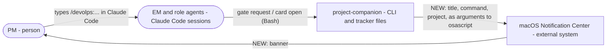
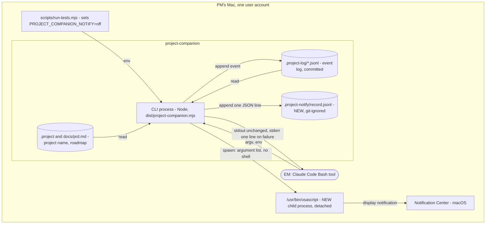
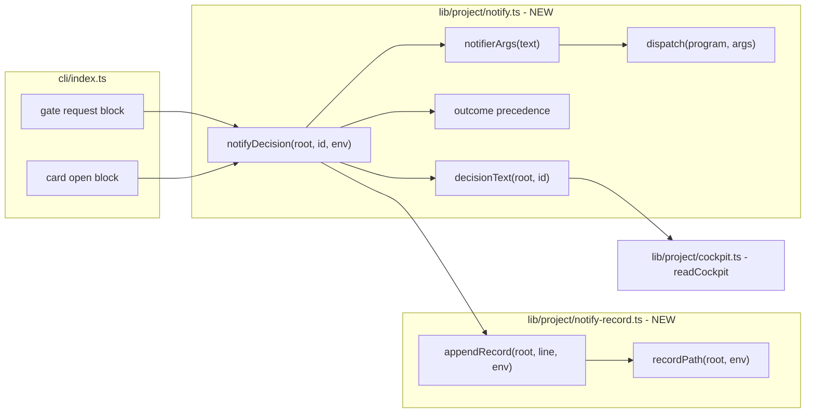
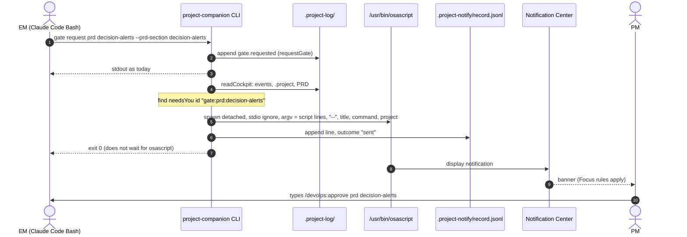
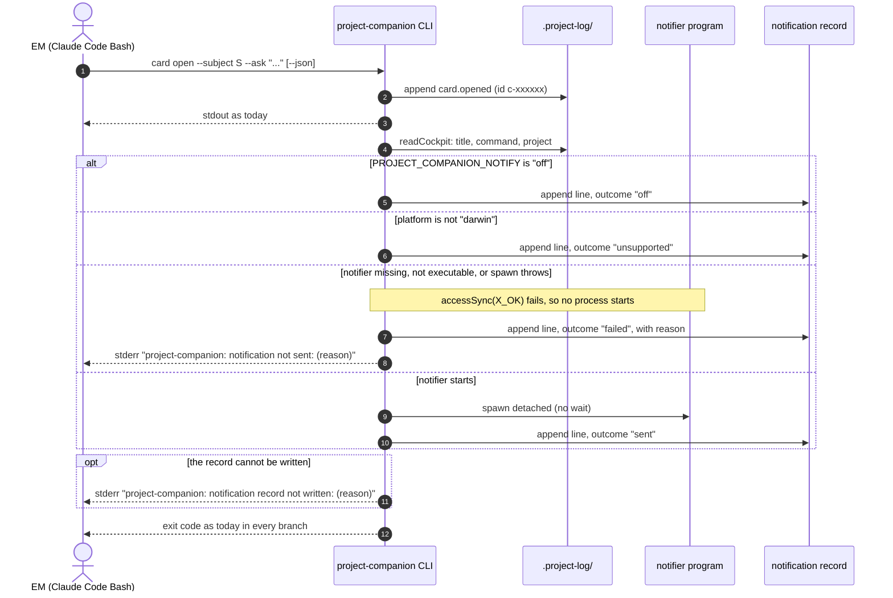

# Design: decision-alerts
Status: draft      Owner: architect      Date: 2026-10-08

Bottom line: after `gate request` or `card open` records a decision, the CLI reads that decision's title and
command from the cockpit model. Then it starts `/usr/bin/osascript` detached, with a fixed script and the text as
arguments after `--`. It writes one JSON line to `.project-notify/record.jsonl` and returns. It does not wait for the
notifier. A notifier problem never changes the command's exit code or standard output. This is a mini design. Most of
its length is the exact contract that the tests need (section 3.3).

## 1. Context and scope

Inputs: `specs/decision-alerts/requirements.md` (approved at the PRD gate on 2026-10-08, 17 criteria),
`specs/decision-alerts/reviews/testability.md`, `docs/prd.md` section "Phase: Decision alerts", and
`docs/ideas/0001-decision-alerts.md`.

Files read for this design: `cli/index.ts` (imports, `die()`, flag helpers, `main()`, the `gate` and `card` blocks,
the `cockpit` command), `lib/project/cockpit.ts` (whole file), `lib/project/gate.ts` (whole file),
`lib/project/events.ts` (whole file), `lib/project/decisions.ts` (`foldCards`), `lib/project/roadmap.ts`
(`readRoadmap`, writers), `lib/project/store.ts` (`readRuns`), `scripts/run-tests.mjs`, `tests/harness.ts`,
`tests/cli.test.ts` (head), `tests/gate.test.ts` (head and CLI section), `tests/devolps-phase3.test.ts` (CLI
helper), `.gitignore`, `package.json`, `README.md` section "Gates, sprints and the PM cockpit", `.claude/settings.json`,
`.claude/harness.json`.

Facts from the code that shape the design:
- Decisions are made in two places only: the `gate request` block and the `card open` block of `cli/index.ts`.
  `main()` is synchronous, and neither block calls `process.exit` on success.
- `buildCockpit` makes each decision's `title` and `command`. Gate ids are `gate:<kind>:<subject>`. Card ids are
  `c-` plus 6 hex characters. `readCockpit(root)` and the functions it calls only read files.
- The existing CLI suites run the CLI with the inherited environment (`tests/gate.test.ts`, `tests/cli.test.ts`) or
  with `{ ...process.env, ...env }` (`tests/devolps-phase3.test.ts`). So an off switch that the test runner sets
  reaches them.
- `scripts/run-tests.mjs` passes no `env` to each suite today.
- `lib/project/events.ts` already uses an environment variable seam: `PROJECT_COMPANION_ACTOR_EMAIL`.

Facts checked on this Mac (2026-10-08):
- macOS 27.0.1, Node v22.23.1. `/usr/bin/osascript` exists. `terminal-notifier` and `alerter`: not found (`which`).
- `osascript -e 'on run argv' … -- '-e' 'return "pwned"' 'x'` returned the 3 arguments unchanged. Without `--`, the
  argument `-e` was read as an option, and the next argument became script source (osascript syntax error -2752). So
  `--` is required for DA-02.4.
- With `--`, arguments that hold `"`, `\`, a line break, `" & (do shell script "…") & "` or a literal `--` arrived
  unchanged.
- The pinned script (section 3.3) compiles with `osacompile`. It was not run, so no notification was shown.
- Node `spawn` of a missing or non-executable program: `child.pid` is `undefined` at once, and `error` is emitted
  later. `spawn` throws `ERR_INVALID_ARG_VALUE` at once when an argument has a NUL character.
- A child started with `detached: true, stdio: "ignore"` and `unref()` does not hold the caller's pipes. In a probe,
  `execFile` returned after 36 ms while a 3-second child still ran.
- A folder that holds a `.gitignore` with `*` is ignored in a new repository, and `git status` stays clean.
  `.project-notify/record.jsonl` is not ignored in this repository today.
- `getconf ARG_MAX` is 1048576 bytes.

In scope: `lib/project/notify.ts` (new), `lib/project/notify-record.ts` (new), two call sites in `cli/index.ts`, the
`env` in `scripts/run-tests.mjs`, one line in `.gitignore`, one paragraph in `README.md`, and `tests/notify.test.ts`
(new). Not in scope: the MCP server (it has no tool that makes a decision), the cockpit page, and the devolps plugin.

## 2. Goals and non-goals

Goals (from the requirements):
1. One macOS notification for each gate request, question card and track card (DA-01.1, DA-01.2, DA-01.6).
2. The cockpit's own title, command and project name (DA-01.3).
3. Only `gate request` and `card open` notify, and only after they record a decision (DA-01.4, DA-01.5).
4. The notifier never fails, slows or changes the command, and never runs the text as code (DA-02.1 to DA-02.5).
5. An off switch, a runner that sets it, and nothing sent on other systems (DA-03.1 to DA-03.4).
6. A local, git-ignored record of each outcome (DA-04.1, DA-04.2).

Non-goals: all non-goals of the requirements. Also: no click action or sound on the notification, no
de-duplication, and no rotation of the record file.

## 3. Design

### 3.1 C4 context / container / component (Mermaid)

Context. The new part is the arrow to macOS.



Container. New elements are marked NEW.



Component.



### 3.2 Sequences (Mermaid)

Flow 1: a gate request, with the notifier available.



Flow 2: a card open, with each other outcome.



### 3.3 Data model and API contracts

**Entry point** (`lib/project/notify.ts`):

```ts
export type NotifyOutcome = "sent" | "off" | "unsupported" | "failed"; // defined in notify-record.ts
export const notifyDecision = (root: string, decisionId: string, env: NodeJS.ProcessEnv = process.env): NotifyOutcome
```

- It never throws, and it never writes to standard output. All of its work is inside one `try`/`catch`.
- `decisionId` is the cockpit's `needsYou[].id`: `gate:<kind>:<subject>` for a gate, or the card id for a card.
- Text: `decisionText(root, id)` calls `readCockpit(root)` and takes `needsYou.find((d) => d.id === id)`. It returns
  `{ title, command, project: model.project }`. When the id is not there, it throws (reason below). Using the
  cockpit model itself makes DA-01.3 true by construction.

**Call sites** (`cli/index.ts`). There are only two (DA-01.5):
- `gate request`: after `say(gate, …)`, call ``notifyDecision(root, `gate:${kind}:${subject}`)``.
- `card open`: after `process.stdout.write(…)`, call `notifyDecision(root, id)`.

Both calls come after the decision is recorded and after standard output is written. A refused input calls `die()`
before them (DA-01.4).

**Environment variables.** Each name is an exported constant.

| Variable (constant, module) | Values | Effect | Set by |
|---|---|---|---|
| `PROJECT_COMPANION_NOTIFY` (`NOTIFY_ENV`, notify.ts) | `off` exactly. Unset or any other value means on. Tests use `on`. | `off`: outcome `off`, no process starts. | PM, CI, `scripts/run-tests.mjs` |
| `PROJECT_COMPANION_NOTIFIER` (`NOTIFIER_ENV`, notify.ts) | An absolute path | The program to start in place of `/usr/bin/osascript`, with the same arguments. A path that is not absolute gives outcome `failed`. | Tests only |
| `PROJECT_COMPANION_NOTIFY_RECORD` (`RECORD_ENV`, notify-record.ts) | A path. A relative path is resolved from the project root. | The record file to use in place of the default. No `.gitignore` is written for it. | Tests only |
| `PROJECT_COMPANION_PLATFORM` (`PLATFORM_ENV`, notify.ts) | Any string | The value to use in place of `process.platform`. Only `darwin` is supported. | Tests only |

**Outcome precedence.** The first match wins. The text lookup runs first, so that `off` and `unsupported` lines
also carry the title and the command (DA-04.1).

| # | Condition | Outcome | Standard error |
|---|---|---|---|
| 1 | `env.PROJECT_COMPANION_NOTIFY === "off"` | `off` | none |
| 2 | `(env.PROJECT_COMPANION_PLATFORM \|\| process.platform) !== "darwin"` | `unsupported` | none |
| 3 | The text lookup failed | `failed` | the failure line |
| 4 | The notifier path is not absolute, or `accessSync(path, constants.X_OK)` throws | `failed` | the failure line |
| 5 | `spawn` throws, or `child.pid === undefined` | `failed` | the failure line |
| 6 | Otherwise | `sent` | none |

**Notifier program and arguments.** This decision is recorded in
`docs/adr/0001-macos-notifier-osascript-argv.md` (ADR-0001, proposed). `NOTIFIER = "/usr/bin/osascript"`. The path is absolute, so `PATH` is never
searched (threat TH-3). `NOTIFY_SCRIPT` is these three lines, exactly:

```
on run argv
display notification (item 2 of argv) with title (item 1 of argv) subtitle (item 3 of argv)
end run
```

`notifierArgs({ title, command, project })` returns exactly:

```ts
["-e", "on run argv",
 "-e", "display notification (item 2 of argv) with title (item 1 of argv) subtitle (item 3 of argv)",
 "-e", "end run",
 "--", title, command, project]
```

Layout: the notification title is the decision title (the bottom line first, as in the requirements' journey). The
subtitle is the project name. The body is the command, because the body wraps and an answer command can be long.
No user text is ever put in the script. The `--` is required: without it, an argument that starts with `-e` becomes
script source (section 1).

**Dispatch** (`dispatch(program, args)` in notify.ts), in this order:

```ts
accessSync(program, constants.X_OK);            // throws: outcome "failed" (gives the reason at once)
const child = spawn(program, args, { detached: true, stdio: "ignore", shell: false, windowsHide: true });
child.once("error", () => {});                  // without a listener, a late 'error' would crash the CLI
if (child.pid === undefined) → "failed"
child.unref();                                  // the CLI exits without waiting (DA-02.3)
```

The child inherits the CLI's environment. `stdio: "ignore"` matters: a child that held the EM's pipes would make
Claude Code's Bash tool, and `execFile` in tests, wait for it.

**Record line** (`lib/project/notify-record.ts`). One line of JSON for each call of `notifyDecision`, written before
the CLI exits:

```json
{"id":"gate:prd:decision-alerts","at":"2026-10-08T09:30:00.000Z","title":"Approve the requirements for \"decision-alerts\"","command":"/devolps:approve prd decision-alerts","outcome":"sent"}
```

- The keys are in this order: `id`, `at`, `title`, `command`, `outcome`. The key `reason` follows only when
  `outcome` is `failed`. The example time is an example only.
- `at` is `new Date().toISOString()`. `title` and `command` are strings, or `null` when the text lookup failed.
- Each line is written with one `appendFileSync(path, JSON.stringify(line) + "\n")`. `JSON.stringify` escapes line
  breaks, so text cannot make a second line (TH-15).
- `NOTIFY_DIR = ".project-notify"` and `NOTIFY_RECORD = ".project-notify/record.jsonl"`, relative to the project
  root.
- `recordPath(root, env)` gives `resolve(root, env.PROJECT_COMPANION_NOTIFY_RECORD)` when the variable is set, or
  `join(root, NOTIFY_RECORD)` when it is not.
- `appendRecord(root, line, env)` creates the parent folder. For the default path only, it then writes
  `.project-notify/.gitignore` with the content `*\n` (flag `wx`; `EEXIST` is ignored). So the record is ignored in
  every repository, not only this one. It throws on failure, and the caller catches it.
- `readRecord(root, env)` returns the lines and skips any line that is not valid JSON. It is for tests and for the
  metric.
- The root `.gitignore` of this repository gets `/.project-notify/`, so that `git check-ignore` passes before the
  folder exists (DA-04.2).

**Standard error lines** (exact prefixes, one line each, ending in `\n`):
- `project-companion: notification not sent: <reason>`, only for outcome `failed` (DA-02.2).
- `project-companion: notification record not written: <reason>`, when `appendRecord` throws (any outcome).

`<reason>` is made only from an error code, the notifier or record path, or the decision id. It never contains the
title, the command or the project name (TH-5). Each line break in it becomes one space. The values are:

| Cause | `<reason>` |
|---|---|
| `accessSync` or `mkdir`/`append` error | `<error.code> <path>`, for example `ENOENT /tmp/pc-x/missing` |
| `spawn` throws | `<error.code>`, for example `ERR_INVALID_ARG_VALUE` |
| No pid and no code | `did not start <path>` |
| Relative notifier path | `not an absolute path: <value>` |
| Decision not in the cockpit | `not in the cockpit: <decision id>` |

**Test runner** (`scripts/run-tests.mjs`, the suite call at line 58):

```js
execFileSync(process.execPath, [bundle], { stdio: "inherit", cwd: ROOT, env: { ...process.env, PROJECT_COMPANION_NOTIFY: "off" } });
```

**README** (section "Gates, sprints and the PM cockpit"): add a paragraph that starts with `**Decision alerts.**`.
The DA-03.4 test reads the text from that line to the next line that starts with `**` or `## `. That text must hold
these 4 strings exactly: `gate request`, `card open`, `PROJECT_COMPANION_NOTIFY=off` and `macOS only`. It should also
name `.project-notify/record.jsonl`, but the test does not check that.

### 3.4 Components and paths

| Path | Change | Lines (estimate) |
|---|---|---|
| `lib/project/notify-record.ts` | New: constants, `recordPath`, `appendRecord`, `readRecord`, types | about 50 |
| `lib/project/notify.ts` | New: constants, `notifyDecision`, `decisionText`, `notifierArgs`, `dispatch` | about 110 |
| `cli/index.ts` | 1 import and 2 calls | about 4 |
| `scripts/run-tests.mjs` | `env` on the suite call | about 1 |
| `.gitignore` | `/.project-notify/` and a comment | about 3 |
| `README.md` | The "Decision alerts" paragraph | about 12 |
| `tests/notify.test.ts` | New suite for all 17 criteria | about 300, split across the tasks |

Proposed build tasks. These are proposals; the EM records them. Each task proves its criteria with
`npm test -- notify`.

| Task | Owner | Component | Criteria | Depends on |
|---|---|---|---|---|
| T1 | devops-sre | Test runner, `scripts/run-tests.mjs` | DA-03.2 (its named test is added in T2) | none |
| T2 | backend-engineer | Notification record, `lib/project/notify-record.ts`; starts `tests/notify.test.ts` with the stub helper and the DA-03.2 test | DA-04.2 | T1, open question 1 |
| T3 | backend-engineer | Notifier, `lib/project/notify.ts`, with in-process tests on a temporary project | DA-02.2, DA-02.3, DA-02.4, DA-03.1, DA-03.3, DA-04.1 | T2 |
| T4 | backend-engineer | CLI, `cli/index.ts`, with CLI subprocess tests and the README test | DA-01.1, DA-01.2, DA-01.3, DA-01.4, DA-01.5, DA-01.6, DA-02.1, DA-02.5 | T1, T3 |
| T5 | tech-writer | README section "Gates, sprints and the PM cockpit" | DA-03.4 | Same pull request as T4 (constitution rule 12) |

Test seams. This table answers the testability review's list, "What the design must provide".

| Need | Seam | Criteria |
|---|---|---|
| A stub in place of the notifier | `PROJECT_COMPANION_NOTIFY=on`, `PROJECT_COMPANION_NOTIFIER=<absolute stub path>`, `PROJECT_COMPANION_PLATFORM=darwin` (so the suite also works on Linux CI) | DA-01.1, DA-01.2, DA-01.3, DA-01.6, DA-02.4 |
| A notifier that cannot start | `PROJECT_COMPANION_NOTIFIER=<tmp>/missing` (gives `ENOENT`) | DA-02.1, DA-02.2 |
| A record that cannot be written | `PROJECT_COMPANION_NOTIFY_RECORD=<tmp>/plain-file/record.jsonl`, where `plain-file` is a regular file (gives `ENOTDIR`, also when run as root) | DA-02.1 |
| No wait for the notifier | Detached dispatch. The stub waits while a hold file exists. | DA-02.3 |
| Arguments only | The stub saves its arguments, each one ending in a NUL character. Items 0 to 6 must equal the fixed prefix. | DA-02.4 |
| The platform | `PROJECT_COMPANION_PLATFORM=linux` and `=win32` | DA-03.3 |
| The off switch in the runner | The `env` in `scripts/run-tests.mjs`. The suite checks `process.env.PROJECT_COMPANION_NOTIFY === "off"`. | DA-03.2 |
| The record path | `NOTIFY_RECORD`, exported | DA-04.1, DA-04.2 |
| Exact keys, stderr text and README strings | Section 3.3 | DA-04.1, DA-02.2, DA-03.4 |
| The card id | `card open --json` prints `{"id":"c-…"}` (this exists today) | DA-01.3 |

Test notes for the QA engineer:
- The stub is a `#!/bin/sh` file that the suite writes to a temporary folder (mode 755). It runs
  `printf '%s\0' "$@"` into `$STUB_OUT/<pid>.tmp`, then renames that file to `<pid>.argv`. If `$STUB_HOLD` is set, it
  waits while that file exists. Then it writes `<pid>.done`. The stub gets `STUB_OUT` and `STUB_HOLD` because the
  child inherits the CLI's environment.
- The record line is written before the CLI exits, and only `notifyDecision` writes it. So "no new record line" after
  a command proves that no notification was dispatched, with no wait (DA-01.4, DA-01.5, DA-03.1). The stub writes
  after the CLI exits, so to read the stub's output the suite waits for the file, with a guard timeout that the QA
  engineer chooses. That timeout is a failure guard, not a requirement.
- DA-02.1 compares standard output with an `off` run. Text output is fixed. Before comparing, remove `requestedAt`
  from `gate request --json` output, and replace `c-[0-9a-f]{6}` in `card open` output.
- DA-02.4: the card question starts with `-e` and has `"`, `\`, a line break and `" & (do shell script "touch PWNED") & "`.
  Recommended extra test, darwin only, skipped when `/usr/bin/osascript` is absent: run osascript with
  `-e 'on run argv' -e 'return item 1 of argv' -e 'end run' -- <that text>` and expect the same text back. This
  shows nothing on screen. It catches a future osascript change in how it reads `--`.
- TH-5: write a project name that has a NUL character (`\u0000` in `.project`). Expect
  `project-companion: notification not sent: ERR_INVALID_ARG_VALUE`, and expect that the name is not in standard
  error.

## 4. Alternatives considered

| Alternative | Why not chosen |
|---|---|
| `terminal-notifier` (Homebrew) | Not installed on this Mac (`which`: not found). The PM would have to install and update it. It is a third-party binary that would receive agent-written text. Its extra features (click actions, grouping) are non-goals. |
| The `node-notifier` npm package | It adds a dependency that vendors a notifier binary into `node_modules`. That is a supply-chain risk for text that agents write. It gives nothing that this slice needs. |
| AppleScript built by string interpolation, with escaping | DA-02.4 forbids relying on escaping. One missed case (a quote, a backslash, `-e`) runs `do shell script` as the PM. |
| Notify from inside `appendEvent` | It would catch every future source of decisions. But it ties a side effect to every event write, including ingest, approvals and the in-process library tests. DA-01.5 would need a filter in the log layer. |
| A long-running watcher on `.project-log/` | It needs a process that always runs. Timed or background reminders are non-goals. |
| A pure `needsYouFrom(...)` taken out of `buildCockpit`, in place of `readCockpit` | It is cheaper per call. But it refactors the cockpit for a cost that is UNKNOWN (not measured). `readCockpit` gives the same text as `cockpit --json` with no refactor. Revisit if the EM reports a slow `gate request`. |
| A bare `osascript` found on `PATH`, with tests putting a stub first on `PATH` | `npx` and `npm run` put `node_modules/.bin` first on `PATH`, so a package could supply an `osascript` (TH-3). An explicit absolute path is safer. |
| A platform seam injected in-process only | The CLI is tested as a subprocess (DA-03.3 compares exit code and output), so the seam must reach the subprocess. |
| The record in `.project-log/` or `.project-cache/` | The PM chose a local, git-ignored file (Q5). The README says that deleting `.project-cache/` may only change latency. |

## 5. Cross-cutting concerns

- **Security.** See `specs/decision-alerts/threat-model.md`. The main controls: a fixed script, text passed only as
  arguments after `--`, `shell: false`, an absolute notifier path, a reason text that never echoes decision text, and
  a notify path that never throws. The two environment overrides can start any program or append to any file. The
  threat model accepts this, with its reason (TH-2, TH-4), for the PM to decide at the design gate.
- **Privacy.** The notification shows decision text on screen. It can appear on the lock screen and during screen
  sharing, depending on macOS settings that the PM controls (TH-6). The record holds the same text. It stays on this
  Mac and is ignored by git twice (the root `.gitignore` and the folder's own `.gitignore`).
- **Observability.** The record is the evidence for the first success metric. `sent` means that osascript started;
  it does not prove that the PM saw the banner. A failure gives one standard error line, which the EM reports.
- **Cost.** No money and no new dependency. For each decision command: one more `readCockpit` (time UNKNOWN, not
  measured), one record append, and one short-lived osascript process (time UNKNOWN; not run, because running it
  shows a notification). The off switch does not skip the cockpit read, because the record needs the text.
- **Accessibility.** macOS shows the notification. VoiceOver and the system display settings apply to it. The text
  is plain words. The command is plain text that the PM can read out and type. No meaning is carried by colour.

## 6. Rollout and rollback

1. Merge order: T1 (the runner's off switch) must merge before T4 (the CLI calls). Without T1, `npm test` on the PM's
   Mac sends real notifications from `tests/gate.test.ts` and `tests/devolps-phase3.test.ts`.
2. After T4 merges and `dist/` is rebuilt, the next real `gate request` or `card open` on the PM's Mac shows a
   notification. There is no flag and no staged rollout: this is one user on one Mac.
3. First-run check (manual, because a test cannot see a notification): the PM confirms that the first real banner
   appears. If it does not appear, the PM looks in System Settings, Notifications, for the app that macOS lists for
   osascript. Which app macOS 27.0.1 names, and whether it asks for permission first, is UNKNOWN.
4. Rollback without code: set `PROJECT_COMPANION_NOTIFY=off` where the EM's commands get their environment. For
   example, the PM adds it to the `env` block of `.claude/settings.json` (only the PM edits `.claude/`). Rollback with
   code: revert T4. That removes the 2 calls, and the new library files stay unused.
5. The record file can be deleted at any time. That only loses metric history.

## 7. Open questions

1. For the EM: no role in `.claude/harness.json` lists `.gitignore` in its write scope, and the plugin defaults are
   UNKNOWN to me. Who adds `/.project-notify/`? Without it, the DA-04.2 test fails in this repository until the
   folder exists.
2. For the PM, at rollout: the app name that macOS 27.0.1 shows for osascript notifications, and whether it asks for
   permission first, is UNKNOWN. A manual check is in section 6, step 3.
3. For the QA engineer: the time that `readCockpit` adds to `gate request` is UNKNOWN. Measure it if the EM reports
   slowness. The fallback is the `needsYouFrom` refactor (section 4).

Requirements covered: DA-01.1, DA-01.2, DA-01.3, DA-01.4, DA-01.5, DA-01.6, DA-02.1, DA-02.2, DA-02.3, DA-02.4, DA-02.5, DA-03.1, DA-03.2, DA-03.3, DA-03.4, DA-04.1, DA-04.2

| ID | Where the design meets it |
|---|---|
| DA-01.1 | `gate request` call site; outcome `sent` (3.3) |
| DA-01.2 | `card open` call site, for question and track cards (3.3) |
| DA-01.3 | `decisionText` reads `readCockpit` `needsYou` and `project` (3.3) |
| DA-01.4 | Calls come after `requestGate` or `appendEvent`; `die()` exits before them (3.3) |
| DA-01.5 | Only the two call sites; the MCP server makes no decisions (1, 3.3) |
| DA-01.6 | One call for each command, no de-duplication, limit or delay (2, 3.3) |
| DA-02.1 | `notifyDecision` never throws or writes stdout; record errors are caught (3.3) |
| DA-02.2 | `project-companion: notification not sent: <reason>` (3.3) |
| DA-02.3 | Detached spawn, `stdio: "ignore"`, `unref()` (3.3) |
| DA-02.4 | Fixed `NOTIFY_SCRIPT`, arguments after `--`, `shell: false` (3.3, TH-1) |
| DA-02.5 | notify.ts and notify-record.ts do not import `appendEvent` (3.4, TH-16) |
| DA-03.1 | Precedence row 1 (3.3) |
| DA-03.2 | `env` in `scripts/run-tests.mjs` (3.3) |
| DA-03.3 | Precedence row 2, `PROJECT_COMPANION_PLATFORM` (3.3) |
| DA-03.4 | `**Decision alerts.**` paragraph with 4 exact strings (3.3) |
| DA-04.1 | Record line with exact keys and 4 outcomes (3.3) |
| DA-04.2 | `.project-notify/`, self-ignoring, plus the root `.gitignore` entry (3.3) |
