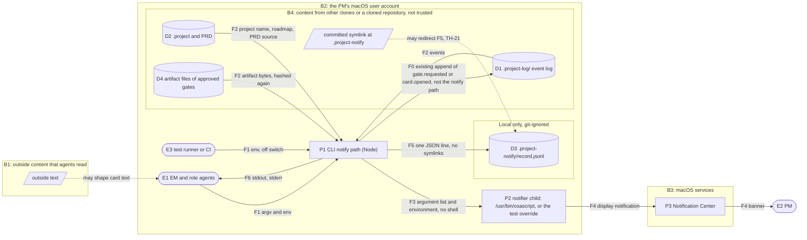

# Threat model: decision-alerts

Status: draft, revision 2. Owner: architect. Date: 2026-10-08. Design: `specs/decision-alerts/design.md`.
Revision 2 applies the security review `specs/decision-alerts/reviews/security.md` (SR-1 to SR-13).

Bottom line: the main new risk is agent-written text reaching AppleScript. The design closes it: the script is
fixed, the text goes only as arguments after `--`, and no shell is used. A required test runs the real osascript to
prove that the text stays data. The second risk is a cloned repository that plants a symlink at the record path. The
record write now refuses symlinks. One test override can start any program. It is accepted, because anyone who can
set the CLI's environment can already run code in the CLI through `NODE_OPTIONS`. The record-path override is gone.
The PM decides on the accepted threats at the design gate.

Method: STRIDE per element. A cell says "n/a" with the reason when the category does not apply. Threat ids (TH-n)
are listed under "Open threats" or "Accepted threats".

Trust boundaries:
- B1: outside content that agents read (web pages, issues, files). It can shape card text.
- B2: the PM's macOS user account. Every process here runs with the PM's rights.
- B3: macOS services.
- B4: content from other clones or a cloned repository: the event log, `.project`, the PRD, the artifact files, and
  any committed symlink. It is inside B2 on disk, but its content is not trusted.

Data-flow diagram:

| Element | Type | S | T | R | I | D | E | Notes |
|---|---|---|---|---|---|---|---|---|
| E1 EM and role agents | External entity | TH-10: any local process can act as the EM and run `gate request` or `card open`. | n/a: an external entity's own input is the flow F1. | The event log records the actor id of each request (existing). TH-20: an agent can run with the off switch, but the record line then shows `off`. | n/a: an external entity; what it receives is F6. | n/a: an external entity; denial of its command is P1 D. | n/a: an external entity; privilege is P1 E and P2 E. | Card text can come from outside content that an agent read (B1, constitution rule 15). The design treats it as data. |
| E2 PM | External entity | TH-11: another local script can show a notification that looks like ours. | n/a: an external entity; the text it sees is F4. | TH-18: nothing proves that the PM saw a banner. `sent` means only that osascript started. | n/a: an external entity; exposure is P3 I. | n/a: an external entity; hidden banners are P3 D. | n/a: the notification has no action. The PM decides only by typing in Claude Code. | Gets text only, across boundary B3. |
| E3 Test runner or CI | External entity | n/a: nothing trusts the runner's identity. It only sets the environment, which any process can set (see TH-20). | n/a: an external entity; its input is F1. | n/a: test runs are not audited. Their records go to temporary projects. | TH-19: a run without the off switch shows test text on the PM's screen. | n/a: an external entity. | n/a: an external entity. | All CLI suites read today inherit or spread `process.env` (`cli`, `gate`, `devolps-phase3`, `merge`, `sync`, per the security review). |
| P1 CLI notify path | Process | TH-10: forged decisions get a real-looking alert. | TH-2: the environment changes the behaviour. TH-20: an agent can silence its own alert. Card text stays data (TH-1). | One record line per decision, with time and outcome (DA-04.1). The event log is unchanged (TH-16). | TH-5: the reason in an error line never uses `error.message` and never holds the title, command or project name. | TH-7: no wait for the notifier. TH-8: never throws, and record errors are caught. Both are mitigated (PM, release 0.3.0 gate). SR-8 is fixed by bugfix d5ebde85; see TH-7 for the residuals. | TH-2: the notifier override. TH-3: absolute path, no `PATH` search. `shell: false`. | One `readCockpit` for each decision command. Its time is UNKNOWN. |
| P2 Notifier child | Process | TH-3: a fake `osascript` on `PATH`. TH-2: the override program. | TH-1: text could become AppleScript. Mitigated: fixed script, `--`, argument list, and a required real-osascript test. | n/a: the notifier keeps no record. P1 records the outcome before the CLI exits. | TH-17: the arguments are visible in the process list, and the child gets the CLI's whole environment. | A stuck osascript keeps one process alive. The CLI does not wait (TH-7). How long osascript runs is UNKNOWN. | The fixed script calls only `display notification`; it has no `do shell script`. It runs as the PM's user. | Whether macOS 27.0.1 asks for notification permission on first use is UNKNOWN. |
| P3 Notification Center | Process (macOS) | TH-11: banners from other scripts look the same. | n/a: an Apple component. It gets text only and changes none of our data. | n/a: outside our system. See TH-18. | TH-6: text on the lock screen, during screen sharing, and in the copy that macOS keeps. | TH-9: a runaway agent can flood the PM with banners. Focus or the notification settings can hide every banner. The cockpit still lists the decision. Accepted by the PM's answer to Q3. | n/a: we ask for no entitlement and send no action. | Boundary B3. Outside our code. |
| D1 Event log `.project-log/` | Data store | n/a: a data store has no identity. Actor ids are claims (existing; see `gate.ts`). | TH-16: the notify path must never write a decision event (DA-02.5). Content merged from other clones is not trusted (B4). | Unchanged hash chain. No notification events, by design (PM's answer to Q5). | Card text is committed today. This epic adds nothing to the log. | The notify path adds one read of all shards per decision command. It writes nothing. A shard can still be a symlink to a device: see TH-7, residual 3. | n/a: data that is never run. | Boundary B4. The notify path only reads it. |
| D2 `.project` and PRD | Data store | n/a: a data store. | The project name is editable text that reaches the notification. It stays data (TH-1). A NUL character in it makes `spawn` throw, which gives outcome `failed` (TH-5 test). | n/a: the notify path only reads it. | The project name appears on screen (TH-6). | Read errors of `.project` and the PRD are caught (`bundle.ts:180`, `roadmap.ts:89-97`). A `.project` symlink to `/dev/zero` gives no error: the read hangs (see TH-7, residual 3). Since bugfix d5ebde85, the PRD source is read only when it is a regular file inside the root. A failed lookup gives `failed`, and the command is unchanged (TH-8). | n/a: data that is never run. | Boundary B4. It also names the PRD source path, which the lookup reads. |
| D4 Artifact files of approved gates | Data store | n/a: a data store. | A merged log can name any path. Since bugfix d5ebde85, `hashArtifact` reads a path only when it is a regular file inside the real project root (`regularFileIn`). A `..` escape, a symlink out of the root, a folder, a device, a FIFO or a socket counts as missing, so the gate becomes stale. An unreadable file gives `lookup failed: EACCES` (TH-5 test). | n/a: the notify path only reads them. | The bytes are only hashed. The notification and the reason do not show them. | SR-8, fixed by bugfix d5ebde85: a device such as `/dev/zero`, or a path outside the root, is never opened. Residual, proposed (TH-7): no size limit for a regular file inside the root. | n/a: data that is never run. | Read by `readGates` and `hashArtifact` inside `readCockpit`. Boundary B4. |
| D3 Notification record `.project-notify/record.jsonl` | Data store (new) | Any local process can append false lines (TH-12). | TH-21: a committed symlink at the folder or the file could send appends outside the project. Mitigated: `lstat` the folder, `O_NOFOLLOW`. TH-12: the record can be edited and has no hash chain. TH-15: forged lines. | The lines have no actor. It is a local metric, not an audit trail (TH-12). | TH-13: decision text could be committed. Mitigated: two `.gitignore` files, and the folder's file comes first. Mode 600, folder mode 700. | TH-14: no limit on growth. A write failure never fails the command (DA-02.1). | TH-21: an append that followed a symlink into a shell start-up file could make `$(...)` in a title run as the PM at the next shell start. Mitigated: no symlink is followed, and no variable changes the path. | New. Local only. The default folder has its own `.gitignore`. |
| F0 P1 to D1, existing append | Data flow | n/a: a flow has no identity. | Existing: the hash chain shows edits. The notify path does not use this flow (TH-16). | n/a: a flow is not an actor. | Existing: the card text is committed. This epic does not change it. | n/a: existing behaviour; this epic adds no append. | n/a: data only. | Shown for completeness. Not part of the notify path. |
| F1 argv and env into P1 | Data flow | n/a: a flow has no identity. See E1 and E3. | Agent-written text, which may carry injected instructions from outside content. Data in every step (TH-1, TH-15). The environment can turn alerts off (TH-20). | n/a: a flow is not an actor. | n/a: the CLI's own arguments are already visible in the process list (existing). | Very long text: `ARG_MAX` is 1048576 bytes on this Mac. If the CLI's own arguments fit, the notifier's arguments are larger by about the size of the script. `E2BIG` from `spawn` gives `failed` (TH-8). | n/a: see P1 E. | Card text may come from outside content (boundary B1). |
| F2 D1, D2, D4 into P1 | Data flow | n/a: a flow has no identity. | Content from other clones (B4) can hold any text and any artifact path. The lookup takes only the decision id that was just recorded, and the text stays data. | n/a: a flow is not an actor. | n/a: a file read inside the same account. Artifact bytes are hashed, not shown. | SR-8 (unbounded artifact reads) is fixed by bugfix d5ebde85. Residuals, proposed: see TH-7. | n/a: data only. | A card id collision (`c-` plus 6 hex) makes `foldCards` keep the older card. The text can then be wrong, or the lookup fails (`failed`). |
| F3 P1 to P2, arguments and environment | Data flow | n/a: a flow has no identity. See P2 S. | TH-1. | n/a: a flow is not an actor. | TH-17: the arguments are visible in the process list, and the child gets the CLI's whole environment, with any secret in it. | A NUL character or `E2BIG` makes `spawn` throw, which gives `failed` (TH-8). | n/a: see P2 E. | Crosses a process boundary inside B2. |
| F4 P2 to P3 to the PM | Data flow | n/a: inside macOS. See P3 S. | n/a: inside macOS. We cannot change the text after `spawn`. | n/a: a flow is not an actor. | TH-6. | Focus can hold back the banner. Accepted (Q3). | n/a: no action is attached. | Crosses boundary B3. |
| F5 P1 to D3 | Data flow | n/a: a flow has no identity. | TH-15: a line break in the text cannot make a second line. TH-21: the flow never follows a symlink. | n/a: a flow is not an actor. | n/a: a local file in the project, mode 600, inside the same account. | TH-8: a failed write gives one standard error line, and the command goes on. | n/a: data only. | Inside B2. Local only. |
| F6 P1 to E1, stdout and stderr | Data flow | n/a: a flow has no identity. | Standard output is unchanged by design (DA-02.1). | n/a: a flow is not an actor. | TH-5: decision text must not be echoed back into the EM's context. | n/a: at most 2 standard error lines for each command. | n/a: output only. | Goes back into an agent's context. |

Open threats: mitigated by the design, but open until the named test passes. The EM records them.
- TH-1. Agent-written text becomes AppleScript and runs as the PM, for example `do shell script`, or an argument
  that starts with `-e`. `flag()` in `cli/index.ts` refuses a value that starts with `--`, but accepts one that starts
  with `-e` (security review, confirmed by the EM). Mitigation: the fixed `NOTIFY_SCRIPT`, the text only after `--`,
  and `shell: false`. Tests: the DA-02.4 stub test (exactly 10 arguments), and the required darwin-only test
  `DA-02.4: osascript passes every argument after -- unchanged`. That test puts `-e`, `-l`, `JavaScript`, `-i` and a
  literal `--` first, in the middle, last and repeated. It passed on this Mac in a probe. Owner: backend-engineer
  (T3). Checked by the qa-engineer.
- TH-3. A fake `osascript` on `PATH` (`npx` and `npm run` put `node_modules/.bin` first). Mitigation: the absolute
  path `/usr/bin/osascript`. That path is on the macOS system volume. On this Mac, `csrutil status` says "enabled",
  `/` is mounted "sealed, read-only", and `touch /usr/bin/.pc-probe` fails with "Operation not permitted". Test: the
  pure `notifierPath({})` equals `"/usr/bin/osascript"`. Nothing is spawned. Owner: backend-engineer (T3).
- TH-5. Error text echoes decision text into the EM's context, which is a path for prompt injection. Node's
  `ERR_INVALID_ARG_VALUE` message includes the bad value, and other messages include paths. Mitigation: the reason
  never uses `error.message`. It is made only from an error code or name, a path the code passed, or the decision id
  (for a gate, this holds the subject that the EM gave in the same command). Each character from U+0000 to U+001F and
  from U+007F to U+009F becomes a space. A failed lookup gives `lookup failed: <code or name>`, and any other caught
  error gives `<code or name>`. Tests: a project name with a NUL character, and the lookup test with an unreadable
  artifact file (`lookup failed: EACCES`), in process and through the CLI, as in the design's test notes. Owner:
  backend-engineer (T3).
- TH-7. A slow or stuck notifier holds the EM's command. Mitigation: `detached: true`, `stdio: "ignore"`, `unref()`.
  Test: DA-02.3. Owner: backend-engineer (T3). Status: mitigated. At the release 0.3.0 gate the PM decided: "Record
  TH-7 and TH-8 as mitigated, with SR-8 as the residual." SR-8 (the text lookup runs inside the command, and a merged
  log could name a very large file or `/dev/zero`) is fixed by bugfix d5ebde85 (PR #22): the artifact and PRD source
  reads open only a regular file inside the real project root, and `prd init` writes only inside the root, with `wx`.
  Residuals named by the PR #22 reviews, proposed for the PM's decision at the PR #22 merge (not accepted yet):
  1. No size limit for a regular file inside the root.
  2. A window between the check and the read or write. In that window, `prd init` can create a new file outside the
     root, but it never overwrites one (`wx`). `editPrd` could overwrite a file outside the root. Only a process that
     runs as the same user at that moment can use the window.
  3. Log shards (`events.ts`) and `.project` (`bundle.ts`) are still read through a symlink or a device. A separate
     bug is proposed. That bug also covers the write-then-rename helpers: `writeText`
     (`lib/project/roadmap.ts:242-246`), `lib/project/bundle.ts:235-237` and `writeJson`
     (`lib/project/store.ts:220-223`). Each writes `<path>.<pid>.tmp` with a plain `writeFileSync`, which follows a
     symlink at that name. Fix: write the temp file with the `wx` flag. Severity: low. A commit would need one planted
     symlink for each possible process id.
- TH-8. A fault in the notify path fails the command. Causes: an unhandled `error` event, a `spawn` throw, a record
  write error, or a broken `.project` or artifact. Mitigation: an `error` listener and one `try`/`catch` around all
  of `notifyDecision`. Test: DA-02.1. Owner: backend-engineer (T3, T4). Status: mitigated (PM, release 0.3.0 gate).
  The SR-8 fix and the proposed residuals of TH-7 apply too, because a slow lookup is not a fault that `try`/`catch`
  can catch.
- TH-13. The record, which holds decision text, gets committed. Mitigation: `/.project-notify/` in the root
  `.gitignore`, and `.project-notify/.gitignore` with `*`. That file is written before the first append. If it
  fails with anything other than `EEXIST`, nothing is appended. Test: DA-04.2, and the order test in the design's
  test notes. Owner: backend-engineer (T2), plus the owner of the root `.gitignore` line (design open question 1).
- TH-15. A line break in a title forges extra record lines. Mitigation: one `JSON.stringify` line for each append.
  Test: DA-04.1 with a multi-line title. Owner: backend-engineer (T2).
- TH-16. The notify path writes or changes a decision. Mitigation: `notify.ts` and `notify-record.ts` do not import
  `appendEvent`. Test: DA-02.5. Owner: backend-engineer (T3, T4).
- TH-19. Test runs send real notifications to the PM. Mitigation: `scripts/run-tests.mjs` sets the off switch, and
  T1 merges before T4. In the notify suite, one helper, `stubEnv(notifier)`, is the only way to turn notifications
  on. It always sets `PROJECT_COMPANION_NOTIFIER` to an absolute path, and the suite never changes `process.env`.
  Tests: DA-03.2, and the helper throws when the path is empty or not absolute. Owner: devops-sre (T1) and
  backend-engineer (T2). Residual: a suite that builds its environment from scratch, or a bundle run by hand, does
  not get the switch.
- TH-21 (new, SR-3). A cloned repository commits `.project-notify` or `.project-notify/record.jsonl` as a symlink.
  Each decision would then append a JSON line with agent text to the target. Worst case: a shell start-up file, where
  `$(...)` in a title runs as the PM at the next shell start. `.gitignore` does not prevent it. Likelihood low;
  impact high. Mitigation: `lstat` the folder and require a real directory (else `ENOTDIR`, nothing written). Write
  `.gitignore` with `wx`, which never follows a symlink. Open the record with
  `O_WRONLY | O_APPEND | O_CREAT | O_NOFOLLOW` and mode `0o600` (a symlink gives `ELOOP`, nothing written). In each
  case the CLI prints the "record not written" line, and the exit code and standard output stay unchanged. Checked on
  this Mac: `O_NOFOLLOW` on a symlinked file gives `ELOOP` and leaves the target unchanged. Residual: a same-user
  process that swaps the folder between the `lstat` and the open could already write the target itself. On Windows,
  Node has no `O_NOFOLLOW`, so only the folder check applies. Test: the TH-21 test in the design's test notes.
  Owner: backend-engineer (T2).

Removed threats:
- TH-4 is removed. The record-path override `PROJECT_COMPANION_NOTIFY_RECORD` no longer exists (SR-1). The DA-02.1
  test uses a regular file named `.project-notify` instead.

## Accepted threats
- TH-2. `PROJECT_COMPANION_NOTIFIER` makes the CLI start any program, with the PM's rights. Accepted, because it adds
  no new ability: anyone who can set the CLI's environment can set `NODE_OPTIONS=--require <file>` and run code
  inside the CLI, or can run the program directly. The `env` block and the hooks of `.claude/settings.json` already
  run commands. Limits: an absolute path only, no `PATH` search, no shell, and the same fixed arguments. Claude Code's
  documented rule (code.claude.com/docs/en/permissions, fetched 2026-10-08 by the security reviewer and by the
  architect): "An allow rule won't match past an assignment of any other variable. A deny or ask rule matches past
  any leading assignment". Only "certain known-safe environment variables" are stripped before an allow rule
  matches. So `PROJECT_COMPANION_NOTIFIER=… project-companion …` is not approved by an allow rule, and the deny rules
  in `.claude/settings.json` still match such a command. The page does not name `PROJECT_COMPANION_NOTIFIER` and does
  not list the known-safe variables, so whether it is on that list is UNKNOWN. How the auto-mode classifier treats it
  is UNKNOWN. A program that the CLI starts is not a Bash tool call, so no Bash rule sees it. The control for
  approvals stays devolps's check of each `via prompt:<id>` against the typed commands (`lib/project/gate.ts`). No
  "test flag" gate is added: whoever can set one variable can set two. The PM decides at the design gate.
- TH-6. Decision text appears on the lock screen and during screen sharing. macOS also keeps its own copy of
  delivered notifications; where, and for how long, is UNKNOWN (not checked; SR-13). Accepted: the PM controls macOS
  "Show previews" and Focus. The same text is already in the committed event log.
- TH-9. A runaway agent that opens many cards floods the PM with banners and starts one osascript for each. Accepted
  by the PM's answer to Q3 (no limit of our own; Focus decides). The rate of decisions is UNKNOWN, because no gate
  was requested in this repository yet.
- TH-10. A local process forges a gate request or card, and the PM gets a real-looking alert. Accepted: this is the
  same trust as the cockpit today. The alert adds reach, not authority. An approval binds to the artifacts' hashes,
  which the PM reviews.
- TH-11. Another local script shows a look-alike notification, or a question card's text reads like a gate title.
  Accepted: any local process can call osascript. The notification has no action, and the cockpit is the source of
  truth. The command in the body shows the kind (`/devolps:approve` or `/devolps:answer`), and a card's command
  cannot approve a gate (SR-10).
- TH-12. The record can be edited or appended to, and it has no hash chain, so the first success metric can be wrong.
  Accepted: it is a local metric, not an audit trail. The event log stays the audit trail.
- TH-14. The record grows with no limit, by one line for each decision. Accepted for this slice: the growth rate is
  UNKNOWN. Deleting the file loses only metric history.
- TH-17. The notification text is visible in the process list while osascript runs, and the child gets the CLI's
  whole environment. Whether other local accounts can read another user's process arguments on macOS 27.0.1 is
  UNKNOWN. Accepted: one user on one Mac, for the short life of the process. The child is Apple's osascript, or a
  test program that the same user chose (TH-2).
- TH-18. `sent` does not prove that the PM saw the banner. Accepted: the requirements say this (DA-04.1).
- TH-20 (new, SR-9). An agent silences its own alert with `PROJECT_COMPANION_NOTIFY=off` or
  `PROJECT_COMPANION_PLATFORM=linux` in front of its command. Accepted: the cockpit still lists the decision, and the
  record line shows `off` or `unsupported`. The first-sprint metric review lists every such line from the PM's Mac as
  a miss (design section 5).
