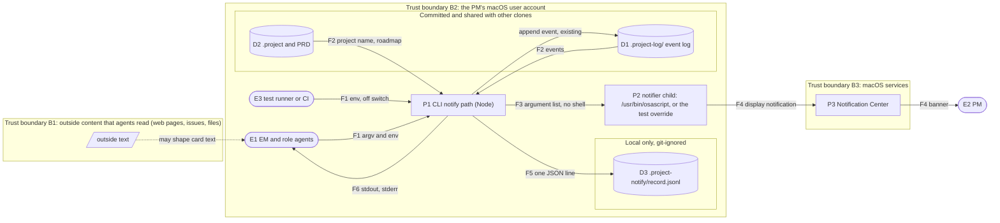

# Threat model: decision-alerts

Status: draft. Owner: architect. Date: 2026-10-08. Design: `specs/decision-alerts/design.md`.

Bottom line: the main new risk is agent-written text reaching AppleScript. The design closes it: the script is
fixed, the text goes only as arguments after `--`, and no shell is used. A probe on this Mac showed that without `--`,
an argument that starts with `-e` becomes script source. The two test overrides can start any program or append to
any file. They are accepted, because anyone who can set the CLI's environment can already run code in the CLI
through `NODE_OPTIONS`. The PM decides on the accepted threats at the design gate.

Method: STRIDE per element. A cell says "n/a" with the reason when the category does not apply. Threat ids (TH-n)
are listed under "Open threats" or "Accepted threats".

Data-flow diagram:

| Element | Type | S | T | R | I | D | E | Notes |
|---|---|---|---|---|---|---|---|---|
| E1 EM and role agents | External entity | TH-10: any local process can act as the EM and run `gate request` or `card open`. | n/a: an external entity's own input is the flow F1. | The event log records the actor id of each request (existing). The record adds the outcome (DA-04.1). | n/a: an external entity; what it receives is F6. | n/a: an external entity; denial of its command is P1 D. | n/a: an external entity; privilege is P1 E and P2 E. | Card text can come from outside content that an agent read (constitution rule 15). The design treats it as data. |
| E2 PM | External entity | TH-11: another local script can show a notification that looks like ours. | n/a: an external entity; the text it sees is F4. | TH-18: nothing proves that the PM saw a banner. `sent` means only that osascript started. | n/a: an external entity; exposure is P3 I. | n/a: an external entity; hidden banners are P3 D. | n/a: the notification has no action. The PM decides only by typing in Claude Code. | Gets text only, across boundary B3. |
| E3 Test runner or CI | External entity | TH-19: a run that does not get the off switch sends real notifications to the PM. | n/a: an external entity; its input is F1. | n/a: test runs are not audited. Their records go to temporary projects. | n/a: an external entity. | n/a: an external entity. | n/a: an external entity. | All CLI suites read today inherit or spread `process.env`. |
| P1 CLI notify path | Process | TH-10: forged decisions get a real-looking alert. | TH-2 and TH-4: the environment changes the behaviour. Card text stays data (TH-1). | One record line per decision, with time and outcome (DA-04.1). The event log is unchanged (TH-16). | TH-5: the reason in an error line never contains decision text. | TH-7: detached, no wait. TH-8: never throws, and record errors are caught. | TH-2: the notifier override. TH-3: absolute path, no `PATH` search. `shell: false`. | One `readCockpit` for each decision command. Its time is UNKNOWN. |
| P2 Notifier child | Process | TH-3: a fake `osascript` on `PATH`. TH-2: the override program. | TH-1: text could become AppleScript. Mitigated: fixed script, `--`, argument list. | n/a: the notifier keeps no record. P1 records the outcome before the CLI exits. | TH-17: the arguments are visible in the process list while osascript runs. | A stuck osascript keeps one process alive. The CLI does not wait (TH-7). How long osascript runs is UNKNOWN. | The fixed script calls only `display notification`; it has no `do shell script`. It runs as the PM's user. | Whether macOS 27.0.1 asks for notification permission on first use is UNKNOWN. |
| P3 Notification Center | Process (macOS) | TH-11: banners from other scripts look the same. | n/a: an Apple component. It gets text only and changes none of our data. | n/a: outside our system. See TH-18. | TH-6: text on the lock screen and during screen sharing. | Focus or the notification settings can hide every banner. The cockpit still lists the decision. Accepted by the PM's answer to Q3. | n/a: we ask for no entitlement and send no action. | Boundary B3. Outside our code. |
| D1 Event log `.project-log/` | Data store | n/a: a data store has no identity. Actor ids are claims (existing; see `gate.ts`). | TH-16: the notify path must never write a decision event (DA-02.5). | Unchanged hash chain. No notification events, by design (PM's answer to Q5). | Card text is committed today. This epic adds nothing to the log. | The notify path adds one read of all shards per decision command. It writes nothing. | n/a: data that is never run. | Committed and shared. The notify path only reads it. |
| D2 `.project` and PRD | Data store | n/a: a data store. | The project name is editable text that reaches the notification. It stays data (TH-1). A NUL character in it makes `spawn` throw, which gives outcome `failed` (TH-5 test). | n/a: the notify path only reads it. | The project name appears on screen (TH-6). | A broken `.project` or PRD makes the text lookup fail. The outcome is `failed`, and the command is unchanged (TH-8). | n/a: data that is never run. | Committed and shared. The notify path only reads it. |
| D3 Notification record `.project-notify/record.jsonl` | Data store (new) | Any local process can append false lines (TH-12). | TH-12: the record can be edited and has no hash chain. TH-4: the override can point appends at another file. TH-15: forged lines. | The lines have no actor. It is a local metric, not an audit trail (TH-12). | TH-13: decision text could be committed. Mitigated: two `.gitignore` files. | TH-14: no limit on growth. A write failure never fails the command (DA-02.1). | n/a: never run. Read only as JSON; bad lines are skipped. | New. Local only. The default folder has its own `.gitignore`. |
| F1 argv and env into P1 | Data flow | n/a: a flow has no identity. See E1 and E3. | Agent-written text, which may carry injected instructions from outside content. Data in every step (TH-1, TH-15). | n/a: a flow is not an actor. | n/a: the CLI's own arguments are already visible in the process list (existing). | Very long text: `ARG_MAX` is 1048576 bytes on this Mac. If the CLI's own arguments fit, the notifier's arguments are larger by about the size of the script. `E2BIG` from `spawn` gives `failed` (TH-8). | n/a: see P1 E. | Card text may come from outside content (boundary B1). |
| F2 events and project into P1 | Data flow | n/a: a flow has no identity. | A log merged from another clone can hold any text. The lookup takes only the decision id that was just recorded. The text stays data. | n/a: a flow is not an actor. | n/a: a local file read inside the same account. | A large log makes the lookup slower. The size at which this matters is UNKNOWN. | n/a: data only. | A card id collision (`c-` plus 6 hex) makes `foldCards` keep the older card. The text can then be wrong, or the lookup fails (`failed`). |
| F3 P1 to P2 arguments | Data flow | n/a: a flow has no identity. See P2 S. | TH-1. | n/a: a flow is not an actor. | TH-17. | A NUL character or `E2BIG` makes `spawn` throw, which gives `failed` (TH-8). | n/a: see P2 E. | Crosses a process boundary inside B2. |
| F4 P2 to P3 to the PM | Data flow | n/a: inside macOS. See P3 S. | n/a: inside macOS. We cannot change the text after `spawn`. | n/a: a flow is not an actor. | TH-6. | Focus can hold back the banner. Accepted (Q3). | n/a: no action is attached. | Crosses boundary B3. |
| F5 P1 to D3 | Data flow | n/a: a flow has no identity. | TH-15: a line break in the text cannot make a second line. | n/a: a flow is not an actor. | n/a: a local file in the project, inside the same account. | TH-8: a failed write gives one standard error line, and the command goes on. | n/a: data only. | Inside B2. Local only. |
| F6 P1 to E1, stdout and stderr | Data flow | n/a: a flow has no identity. | Standard output is unchanged by design (DA-02.1). | n/a: a flow is not an actor. | TH-5: decision text must not be echoed back into the EM's context. | n/a: at most 2 standard error lines for each command. | n/a: output only. | Goes back into an agent's context. |

Open threats: mitigated by the design, but open until the named test passes. The EM records them.
- TH-1. Agent-written text becomes AppleScript and runs as the PM, for example `do shell script`, or an argument
  that starts with `-e`. Mitigation: the fixed `NOTIFY_SCRIPT`, the text only after `--`, and `shell: false`. Test:
  DA-02.4, plus the recommended darwin-only osascript check. Owner: backend-engineer (T3). Checked by the
  qa-engineer.
- TH-3. A fake `osascript` on `PATH` (`npx` and `npm run` put `node_modules/.bin` first). Mitigation: the absolute
  path `/usr/bin/osascript`. That path is on the macOS system volume. On this Mac, `csrutil status` says
  "enabled", `/` is mounted "sealed, read-only", and `touch /usr/bin/.pc-probe` fails with "Operation not
  permitted".
  Test: a unit test that `NOTIFIER === "/usr/bin/osascript"` and that `spawn` gets that path when no override is set.
  Owner: backend-engineer (T3).
- TH-5. Error text echoes decision text into the EM's context, which is a path for prompt injection. Node's
  `ERR_INVALID_ARG_VALUE` message includes the bad value. Mitigation: the reason is made only from an error code,
  a path or the decision id. Test: a project name with a NUL character, as in the design's test notes. Owner:
  backend-engineer (T3).
- TH-7. A slow or stuck notifier holds the EM's command. Mitigation: `detached: true`, `stdio: "ignore"`, `unref()`.
  Test: DA-02.3. Owner: backend-engineer (T3).
- TH-8. A fault in the notify path fails the command. Causes: an unhandled `error` event, a `spawn` throw, a record
  write error or a broken `.project`. Mitigation: an `error` listener and one `try`/`catch` around all of
  `notifyDecision`. Test: DA-02.1. Owner: backend-engineer (T3, T4).
- TH-13. The record, which holds decision text, gets committed. Mitigation: `/.project-notify/` in the root
  `.gitignore`, and `.project-notify/.gitignore` with `*`. Test: DA-04.2. Owner: backend-engineer (T2), plus the
  owner of the `.gitignore` line (design open question 1).
- TH-15. A line break in a title forges extra record lines. Mitigation: one `JSON.stringify` line for each append.
  Test: DA-04.1 with a multi-line title. Owner: backend-engineer (T2).
- TH-16. The notify path writes or changes a decision. Mitigation: `notify.ts` and `notify-record.ts` do not import
  `appendEvent`. Test: DA-02.5. Owner: backend-engineer (T3, T4).
- TH-19. Test runs send real notifications to the PM. Mitigation: `scripts/run-tests.mjs` sets the off switch, and
  T1 merges before T4. Test: DA-03.2. Owner: devops-sre (T1). Residual: a suite that builds its environment from
  scratch, or a bundle run by hand, does not get the switch.

## Accepted threats
- TH-2. `PROJECT_COMPANION_NOTIFIER` makes the CLI start any program, with the PM's rights. Accepted, because it adds
  no new ability: anyone who can set the CLI's environment can set `NODE_OPTIONS=--require <file>` and run code
  inside the CLI, or can run the program directly. The `env` block and the hooks of `.claude/settings.json` already
  run commands. Limits: an absolute path only, no `PATH` search, no shell, and the same fixed arguments. Note: a
  Claude Code deny rule such as `Bash(project-companion gate approve *)` is not a boundary against a program started
  this way. Whether such a rule matches a command with an environment prefix is UNKNOWN. The control for approvals
  stays devolps's check of each `via prompt:<id>` against the typed commands (`lib/project/gate.ts`). The PM decides
  at the design gate.
- TH-4. `PROJECT_COMPANION_NOTIFY_RECORD` can append a JSON line with agent text to any file that the user can
  write, for example a shell start-up file, where `$(...)` inside the text would run when the next shell starts. Accepted for
  the same reason as TH-2: whoever sets the variable can write that file directly. Both overrides are for tests
  only. The README does not advertise them.
- TH-6. Decision text appears on the lock screen and during screen sharing. Accepted: the PM controls macOS
  "Show previews" and Focus. The same text is already in the committed event log.
- TH-9. A runaway agent that opens many cards floods the PM with banners and starts one osascript for each. Accepted
  by the PM's answer to Q3 (no limit of our own; Focus decides). The rate of decisions is UNKNOWN, because no gate
  was requested in this repository yet.
- TH-10. A local process forges a gate request or card, and the PM gets a real-looking alert. Accepted: this is the
  same trust as the cockpit today. The alert adds reach, not authority. An approval binds to the artifacts' hashes,
  which the PM reviews.
- TH-11. Another local script shows a look-alike notification. Accepted: any local process can call osascript. The
  notification has no action, and the cockpit is the source of truth.
- TH-12. The record can be edited or appended to, and it has no hash chain, so the first success metric can be wrong.
  Accepted: it is a local metric, not an audit trail. The event log stays the audit trail.
- TH-14. The record grows with no limit, by one line for each decision. Accepted for this slice: the growth rate is
  UNKNOWN. Deleting the file loses only metric history.
- TH-17. The notification text is visible in the process list while osascript runs. Whether other local accounts can
  read another user's process arguments on macOS 27.0.1 is UNKNOWN. Accepted: one user on one Mac, for the short
  life of the process.
- TH-18. `sent` does not prove that the PM saw the banner. Accepted: the requirements say this (DA-04.1).
